# Getting Started
## Overview
This Immersion Day provides customers with hands-on experience with Amazon Comprehend and Amazon SageMaker demonstrating how they can build natural language processing (NLP) use cases, and is specifically designed to help us accelerate a customer opportunity.

After attending this Immersion Day, customers would be able to leverage the service to predict the classfication for any given text.

## AWS Accounts
For running an Immersion Day where you need to use your own AWS accounts. Follow the below best practices:

Use a AWS account that is not running production systems.
Any accounts should be created a minimum of three days ahead of time. It takes time for new accounts to be completely ready, payment methods to be confirmed, and limits to be set.

## Prerequisites
### Prerequisites for this workshop
You need a PC or a laptop with a web browser, preferably with the latest version of Chrome / FireFox
For Self-paced Lab, you will need an AWS Account. Checkout AWS Free tier  to sign-up for an account.
This workshop must be run only in regions where Amazon Comprehend is generally available. For a list of regions see Amazon Comprehend regions  regions. It is recommended to execute this workshop in us-east-1.

## AWS Instructor-Led Lab
[Event Engine AWS Account access](https://catalog.us-east-1.prod.workshops.aws/workshops/b54ae619-4779-409c-9bde-6e9c00edcf0f/en-US/introduction/02-instructor-led#event-engine-aws-account-access)

## Training Custom Classifier
### Amazon SageMaker
Amazon SageMaker is a fully managed service that provides every developer and data scientist with the ability to build, train, and deploy machine learning (ML) models quickly. SageMaker removes the heavy lifting from each step of the machine learning process to make it easier to develop high quality models.

### Launch Amazon SageMaker Studio
Amazon SageMaker Studio is a web-based, integrated development environment (IDE) for machine learning that lets you build, train, debug, deploy, and monitor your machine learning models. Studio provides all the tools you need to take your models from experimentation to production while boosting your productivity.

Here are the one-time steps for onboarding to Amazon SageMaker Studio using Quick Setup:

1. Open AWS console and switch to AWS region that your instructor would like you to use.
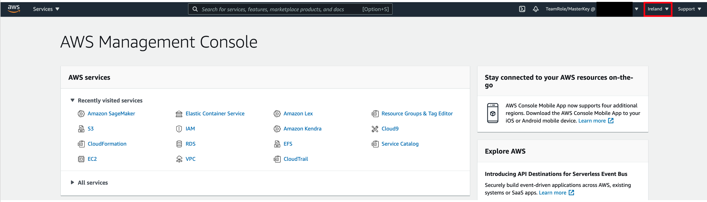

2. In the search bar, type SageMaker and click on Amazon SageMaker.
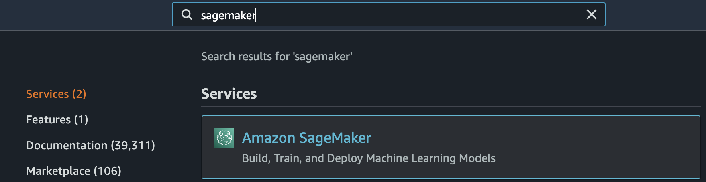

3. Click on Amazon SageMaker Studio (first option on the left pane).  
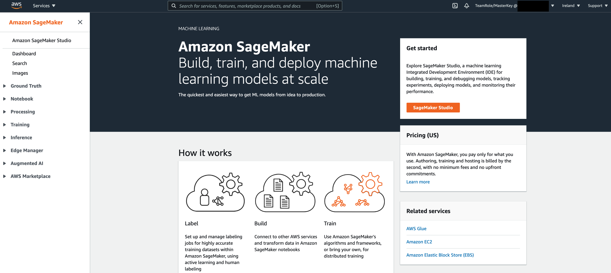

4. Click on Quick start.
5. Define Name as sagemakeruser for example.
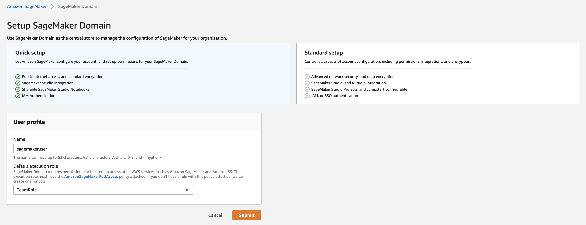

6. Select Create a new role under Execution role.
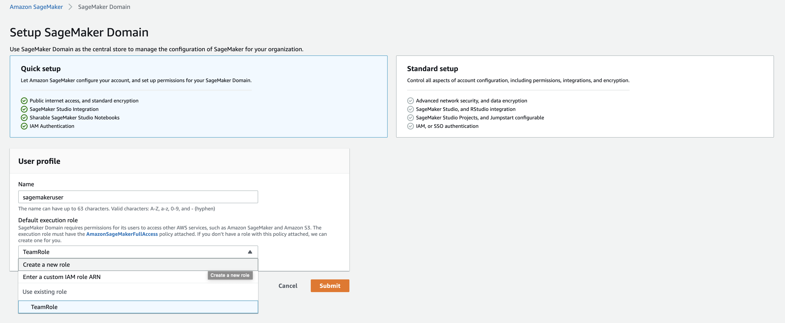

7. Keep the default and click Create Role.
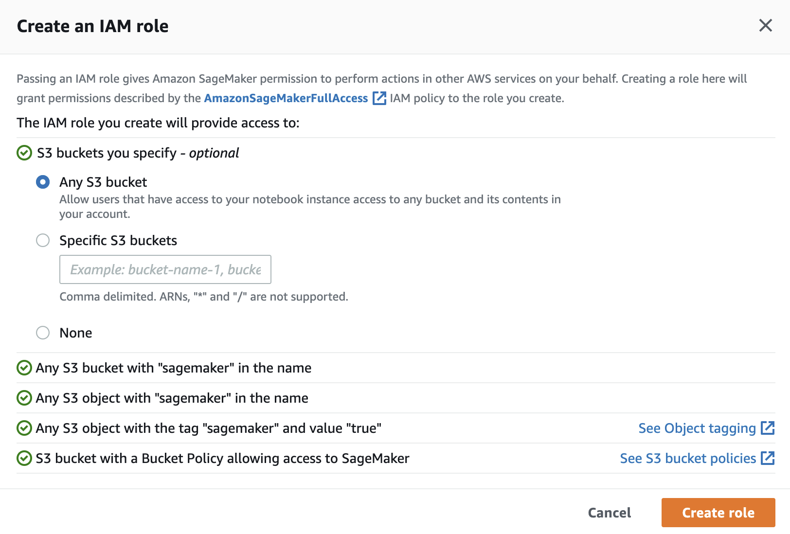

8. You will see that the role is successfully created.
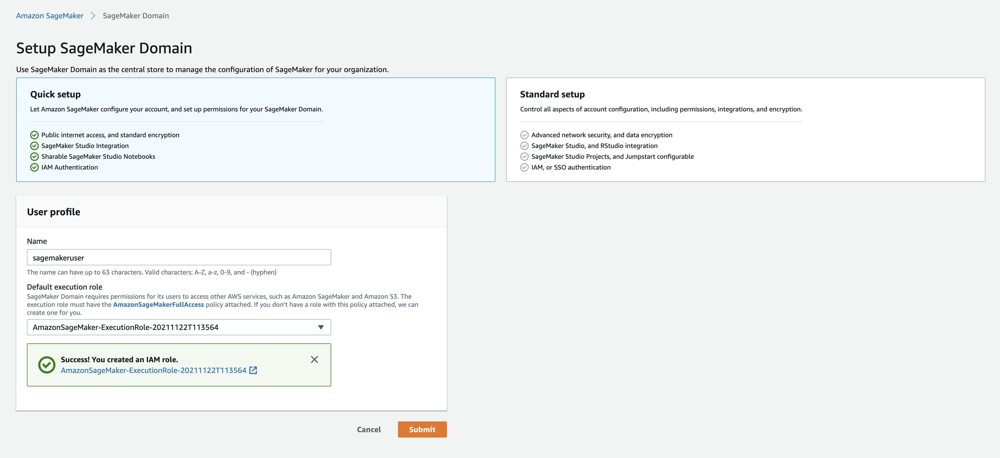

9. Click Submit. The SageMaker Studio environment will stay in Pending state for a few minutes.
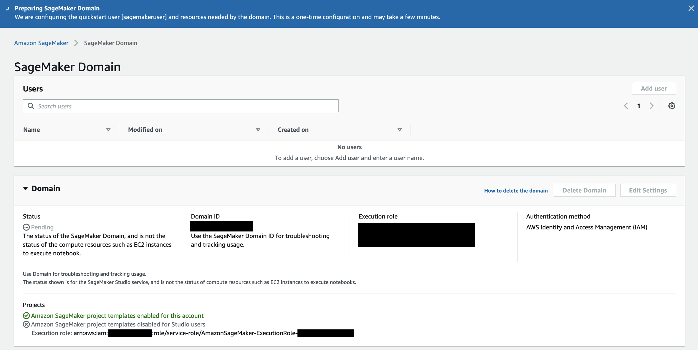

10. After a few minutes, the SageMaker Studio Domain will be provisioned. Click on Studio under Launch app on the right of the screen.
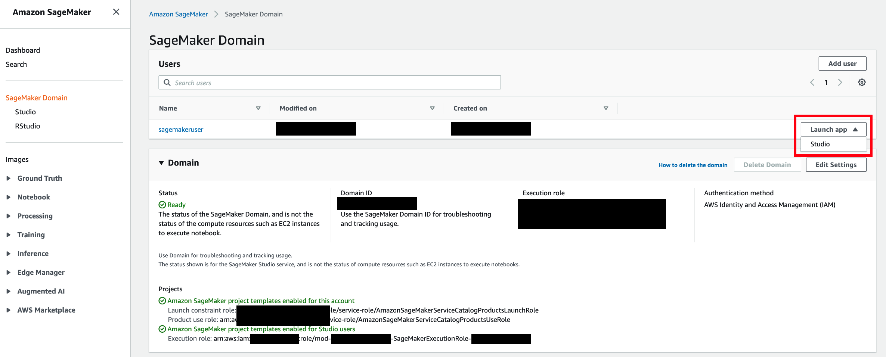

11. Once Amazon SageMaker Studio is ready then click on Open Studio. The page can take 1 or 2 minutes to load when you access SageMaker Studio for the first time.
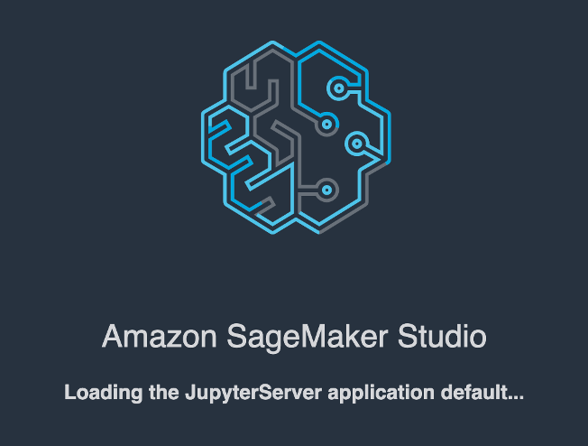

12. You will be redirected to a new web tab that looks like this:

13. To check out this github repository, open a Sagemaker Studio terminal
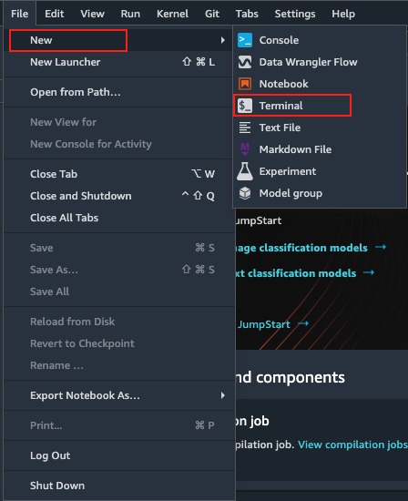

14. In the terminal, checkout the github repository: `git clone https://github.com/wei-m-teh/comprehend-sagemaker-text-classification`

Preprocess Data
In this lab we will be using a notebook in Amazon SageMaker to preprocess data in the format that Comprehend needs to use. Note that this code can be run in many different ways - a notebook is handy to run and explain code.

Open the comprehend-news-transform.ipynb in Amazon SageMaker Notebook that you provisioned by following the below steps. This Notebook is located in the following Git repository: https://github.com/aws-samples/comprehend-immersion-day

In the AWS console, Under services search for Amazon SageMaker
