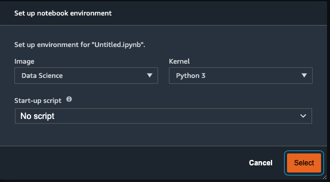
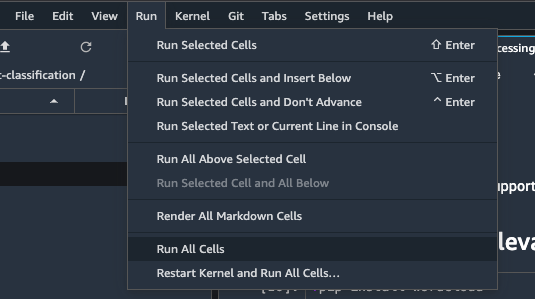

# Preprocess Data
In this lab we will be using a Amazon SageMaker Studio Notebook to preprocess data in the format that Comprehend needs to use.

1. Open the [preprocessing.ipynb](preprocessing.ipynb) in SageMaker Studio by double clicking the file on the left panel

2. If prompted for a notebook environment, select “Data Science” image with Python 3 Kernel

3. Click Run > “Run All Cells“ and read through the steps in the notebook. This notebook runs through steps to process data for comprehend. In a notebook, each cell accomplishes a particular task. Each task is document in the notebook. The notebooks takes about 2 minutes to run.

<b>Take note of the last line in the file - that’s the file we will use in Comprehend to train our classifier.</b>

Let's move on the training a model using Amazon Comprehend [here](README.train.md)
