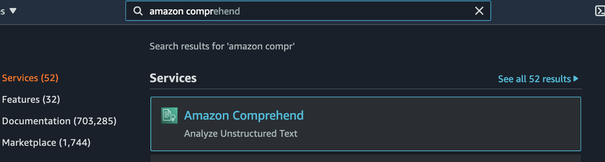
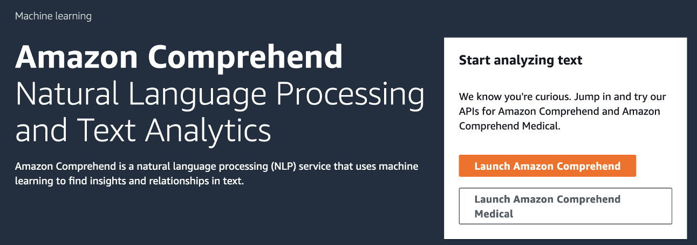
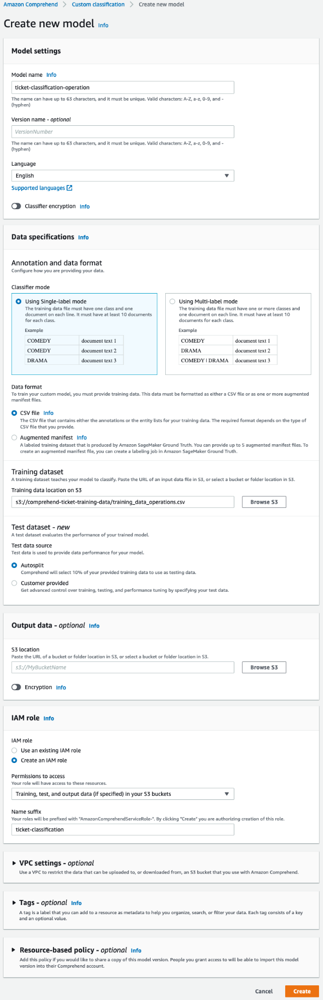
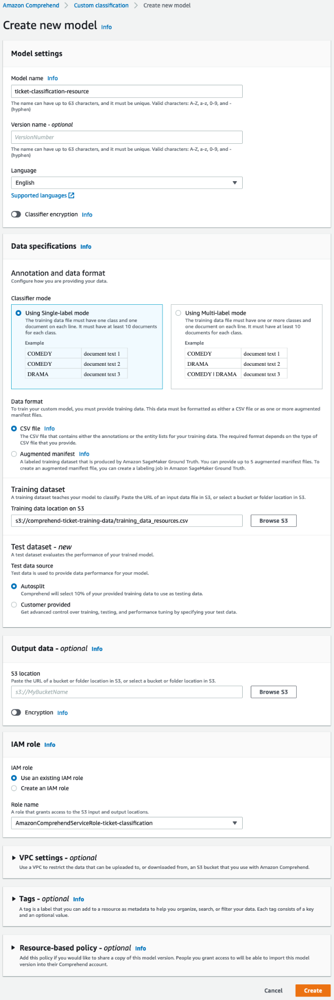
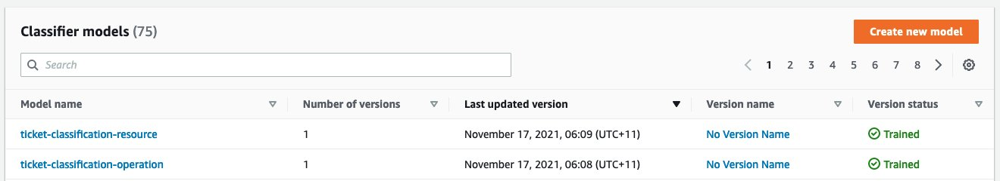
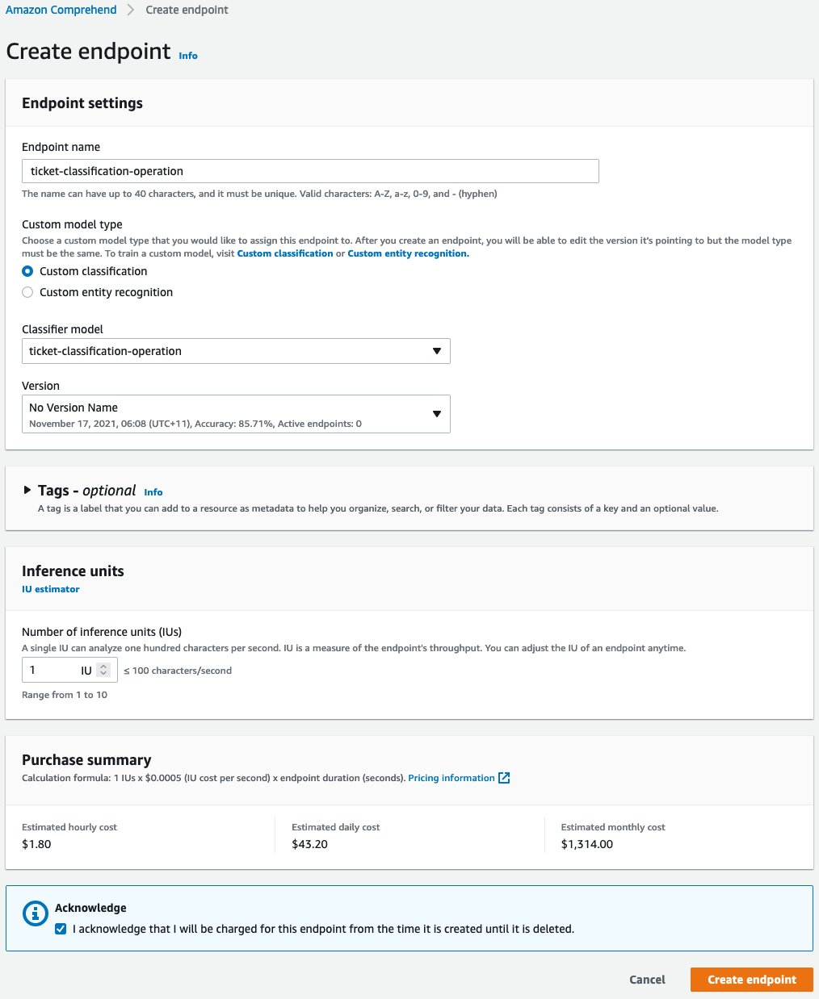
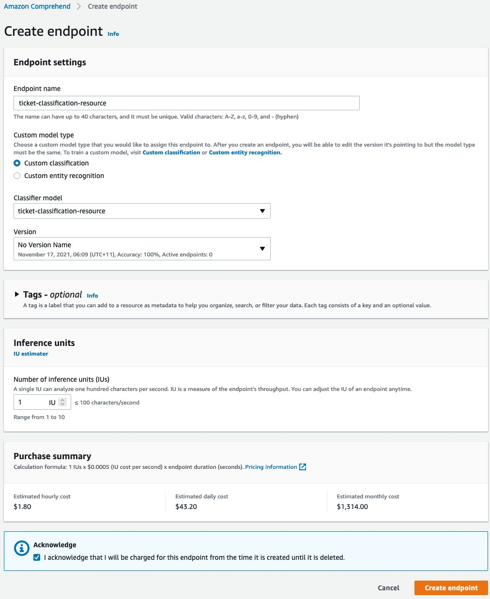
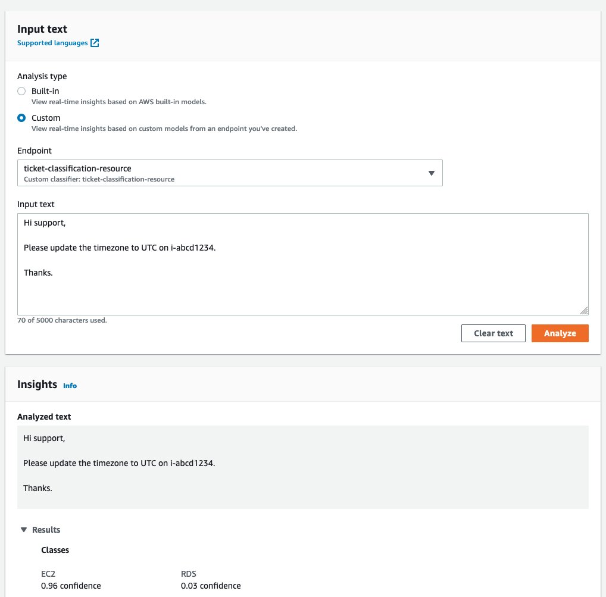

## Train Your Model
You will be using Amazon Comprehend Custom Classification to train your Model. Amazon Comprehend uses natural language processing (NLP) to extract insights about the content of documents. Amazon Comprehend processes any text file in UTF-8 format. It develops insights by recognizing the entities, key phrases, language, sentiments, and other common elements in a document.

You can use Amazon Comprehend to build your own models for custom classification. Custom classification is a two-step process. First, you train a custom classifier to recognize the classes that are of interest to you. Then you send unlabeled documents to be classified.

To train the classifier, specify the options you want, and send Amazon Comprehend documents to be used as training material. Based on the options you indicated, Amazon Comprehend creates a custom ML model that it trains based on the documents you provided. This custom model (the classifier) examines each document you submit. It then returns either the specific class that best represents the content (if you're using multi-class mode) or the set of classes that apply to it (if you're using multi-label mode).

1. In the AWS console, select `Amazon Comprehend`

2. Click `Launch Amazon Comprehend`

3. On the Amazon Comprehend console, choose `Custom classification` in the navigation pane.
   * Choose Create new model.
   * Provide the following information:
     - For Model name, enter `ticket-classification-operation`.
     - For Language, choose `English`.
     - For Classifier mode, select Using `Single-label` mode.
     - For Data format, select `CSV file`.
     - For Training dataset, enter the S3 path (the path referenced in the Sagemaker Studio Notebook) for `training_data_operations.csv`.
     - For Test data source, select `Autosplit`. Autosplit automatically selects 10% of your provided training data to use as testing data.
     - For IAM Role, select Create an IAM role.
     - For Permissions to access, choose the training, test, and output data (if specified) in your S3 buckets.
     - For Name suffix, enter ticket-classification.
     - Choose Create.


4. Choose Create new model again to create your resource classification model.
   - For Model name, enter `ticket-classification-resource`.
   - For Language, choose `English`.
   - For Classifier mode, select Using `Single-label` mode.
   - For Data format, select `CSV file`.
   - For Training dataset, enter the S3 path (the path referenced in the Sagemaker Studio Notebook)for `training_data_resources.csv`.
   - For Test data source, select `Autosplit`.
   - For IAM Role, select `Use an existing IAM role`.
   - For Role name, choose `AmazonComprehendServiceRole-ticket-classification`.
   - Choose create



5. Amazon Comprehend is now processing the CSV files and using them to train custom classifiers. We then use these to help classify customer tickets. The larger and more accurate our training data is, the more accurate the classifier will be.

6. Wait for the version status to show as Trained as below. It may take up to 1 hour to complete, depending on the size of the training data.



## Create Amazon Comprehend endpoints
Amazon Comprehend endpoints are billed in 1-second increments, with a minimum of 60 seconds. Charges continue to incur from the time you start the endpoint until it’s deleted, even if no documents are analyzed. For more information, see Amazon Comprehend Pricing. To create your endpoints, complete the following steps:

1. On the Amazon Comprehend console, choose Endpoints in the navigation pane.
2. Choose Create endpoint to create your operation classification endpoint.
3. Provide the following information:
   - For Endpoint name, enter `ticket-classification-operation`.
   - For Custom model type, select `Custom classification`.
   - For Classifier model, choose `ticket-classification-operation`.
   - For Version, choose `No Version Name`.
   - For Number of inference units (IUs), enter `1`.
   - Choose Create endpoint.


4. Choose Create endpoint again to create the resource classification endpoint.
5. Provide the following information:
   - For Endpoint name, enter `ticket-classification-resource`.
   - For Custom model type, select `Custom classification`.
   - For Classifier model, choose `ticket-classification-resource`.
   - For Version, choose `No Version Name`.
   - For Number of inference units (IUs), enter `1`.
   - Choose Create endpoint.


After you create both endpoints, wait until the status for both shows as `Active`.

## Test the Amazon Comprehend endpoints with real-time analysis
To test your endpoints, complete the following steps:

1. On the Amazon Comprehend console, choose `Real-time analysis` in the navigation pane.
2. For Analysis type¸ select `Custom`.
3. For Endpoint¸ choose `ticket-classification-operation`.
4. For Input text, enter the following:
  ```
  Hi support,
  Please update the timezone to UTC on i-abcd1234.
  Thanks.
  ```
5. Choose Analyze.
The results show that the Update class has the highest confidence score.
6. Change Endpoint to ticket-classification-resource and choose Analyze again.
The results show that the EC2 class has the highest confidence score.


